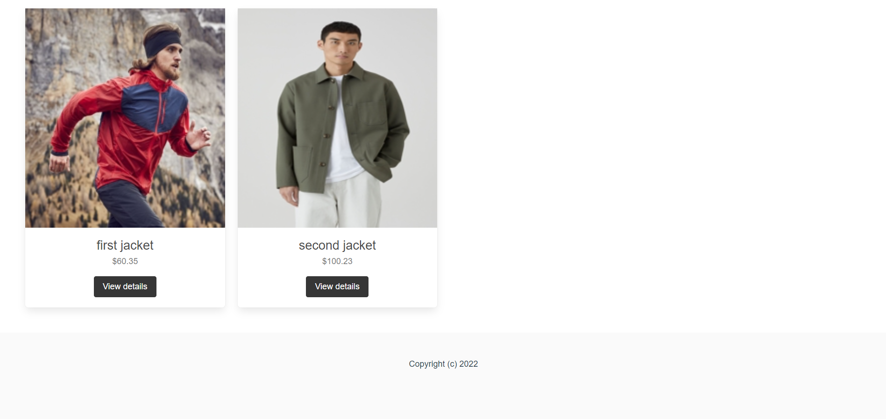
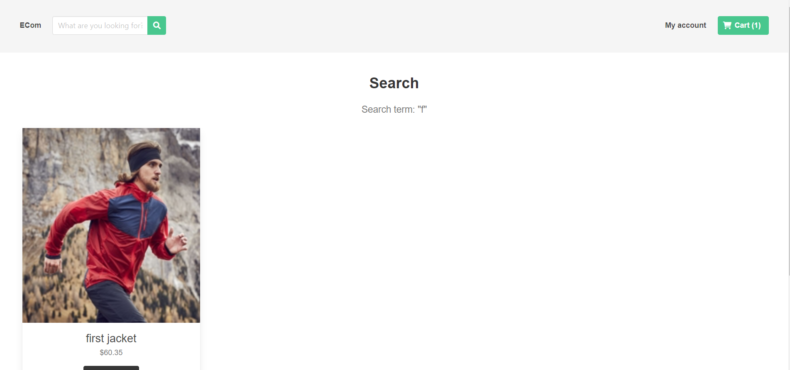
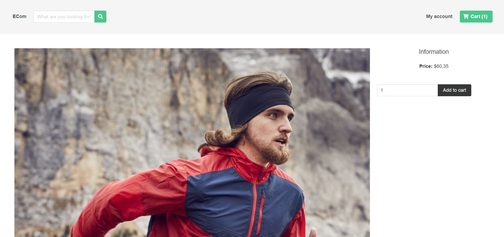
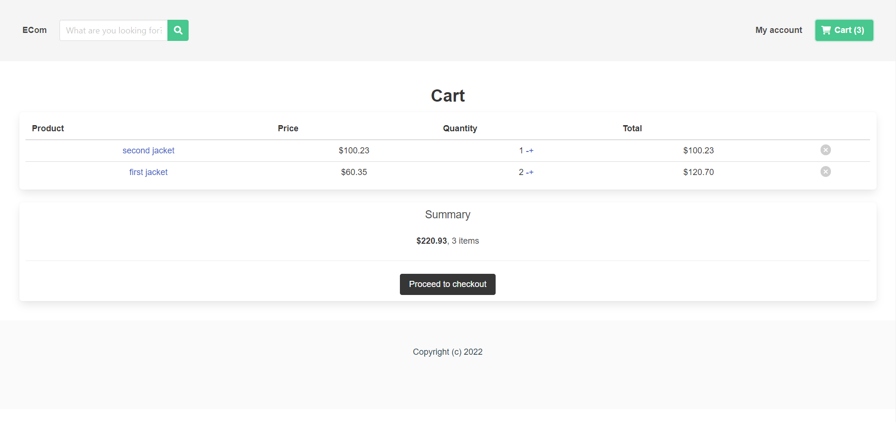
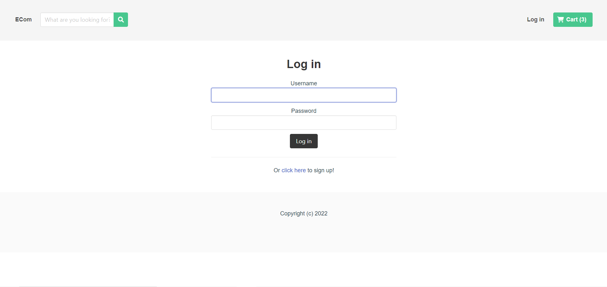
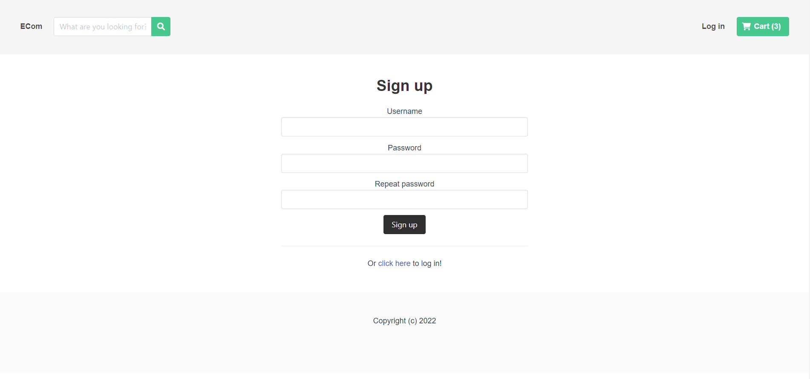

# EcommerceREST
Ecommerce website using Django REST framework and VUE.js
## 1.Home page(1) 
## 2.Home page(2) 
## 3.Search page 
## 4.Detail page 
## 5.Cart page 
## 6.Login page 
## 7.Register page 

